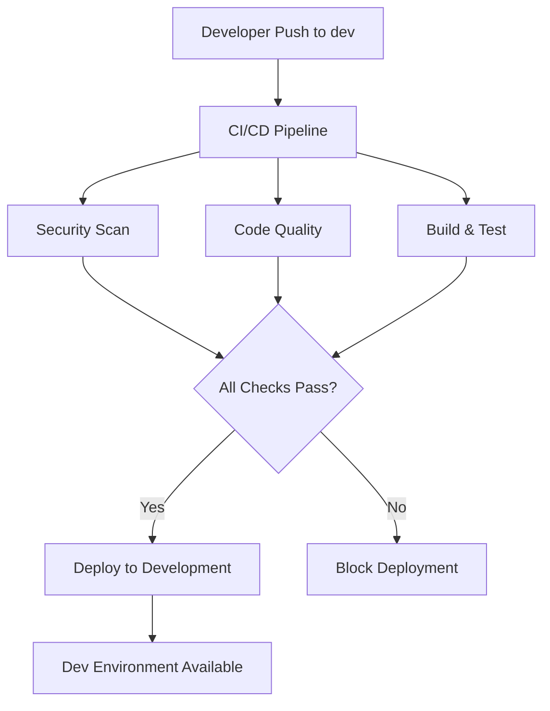
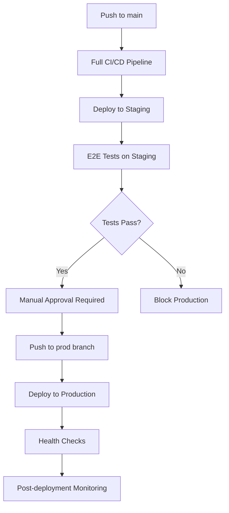

# 🛡️ Shield AI - CI/CD Pipeline Documentation

## Overview

This directory contains GitHub Actions workflows for the Shield AI project, providing comprehensive CI/CD automation including testing, security scanning, deployment, and release management.

## 📁 Workflow Files

### Core Workflows

| Workflow | File | Purpose | Triggers |
|----------|------|---------|----------|
| **Main CI/CD** | `ci-cd.yml` | Primary pipeline for testing, building, and deployment | Push to main/dev/prod, PRs |
| **Testing Suite** | `test.yml` | Comprehensive testing including unit, E2E, accessibility, security | Push, PRs, scheduled |
| **Dependencies** | `dependencies.yml` | Dependency management, security updates, analysis | Scheduled weekly, manual |
| **Release Management** | `release.yml` | Automated releases, versioning, deployment | Tags, manual trigger |
| **Legacy CI** | `ci.yml` | Backward compatibility (disabled by default) | Manual only |

## 🚀 Pipeline Flow

### Development Flow


### Production Flow


## 🔧 Environment Setup

### Required Secrets

Configure these secrets in your GitHub repository settings:

#### Vercel Deployment
- `VERCEL_TOKEN` - Vercel deployment token
- `VERCEL_ORG_ID` - Your Vercel organization ID
- `VERCEL_PROJECT_ID` - Project ID in Vercel

#### Application Secrets (Production)
- `NEXT_PUBLIC_SUPABASE_URL` - Supabase project URL
- `NEXT_PUBLIC_SUPABASE_ANON_KEY` - Supabase anonymous key
- `SUPABASE_SERVICE_ROLE_KEY` - Supabase service role key
- `OPENAI_API_KEY` - OpenAI API key
- `STRIPE_SECRET_KEY` - Stripe secret key
- `NEXT_PUBLIC_STRIPE_PUBLISHABLE_KEY` - Stripe publishable key
- `STRIPE_WEBHOOK_SECRET` - Stripe webhook secret
- `API_BIBLE_KEY` - API.Bible access key
- `PINECONE_API_KEY` - Pinecone vector database key
- `PINECONE_ENVIRONMENT` - Pinecone environment

#### Development/Staging Secrets
- `DEV_NEXT_PUBLIC_SUPABASE_URL` - Development Supabase URL
- `DEV_NEXT_PUBLIC_SUPABASE_ANON_KEY` - Development Supabase key
- `STAGING_NEXT_PUBLIC_SUPABASE_URL` - Staging Supabase URL
- `STAGING_NEXT_PUBLIC_SUPABASE_ANON_KEY` - Staging Supabase key

#### Optional (Enhanced Features)
- `CODECOV_TOKEN` - Code coverage reporting
- `SNYK_TOKEN` - Advanced security scanning

### Environment Variables

Each environment has specific configuration in the `environments/` directory:

- **Development**: `development.yml`
- **Staging**: `staging.yml`  
- **Production**: `production.yml`

## 🧪 Testing Strategy

### Test Types

| Test Type | Purpose | When | Tools |
|-----------|---------|------|-------|
| **Unit Tests** | Component/function testing | Every PR | Jest, Testing Library |
| **Integration Tests** | API and service integration | Every PR | Custom test suite |
| **E2E Tests** | Full user workflow testing | Staging/Production | Playwright |
| **Accessibility** | WCAG compliance | Every PR | axe-core |
| **Security** | Vulnerability scanning | Every PR | npm audit, OWASP ZAP |
| **Performance** | Load and performance testing | Staging | Artillery, Lighthouse |

### Test Configuration

```yaml
# Example test job
unit-tests:
  runs-on: ubuntu-latest
  strategy:
    matrix:
      node-version: [18.x, 20.x]
  steps:
    - uses: actions/checkout@v4
    - name: Setup Node.js
      uses: actions/setup-node@v4
    - name: Run tests
      run: npm test
```

## 🔒 Security Features

### Security Scanning
- **CodeQL Analysis** - GitHub's semantic code analysis
- **Dependency Review** - Check for vulnerable dependencies
- **Security Audit** - npm audit for known vulnerabilities
- **Secret Scanning** - TruffleHog for exposed secrets
- **OWASP ZAP** - Dynamic application security testing

### Security Gates
- All security checks must pass before deployment
- High/Critical vulnerabilities block deployment
- Automatic security update PRs
- License compliance checking

## 📦 Deployment Strategy

### Environments

| Environment | Branch | URL | Purpose |
|-------------|--------|-----|---------|
| **Development** | `dev` | `dev-shieldai.vercel.app` | Feature development and testing |
| **Staging** | `main` | `staging-shieldai.vercel.app` | Production-like testing |
| **Production** | `prod` | `shieldai.vercel.app` | Live application |

### Deployment Gates

#### Development
- ✅ Basic linting and build
- ✅ Unit tests pass
- 🚀 Auto-deploy on `dev` branch push

#### Staging  
- ✅ All security checks pass
- ✅ All tests pass (unit, integration)
- ✅ Code quality checks
- 🚀 Auto-deploy on `main` branch push

#### Production
- ✅ All staging checks pass
- ✅ E2E tests on staging environment
- ✅ Manual approval required
- ✅ Multiple reviewer approval
- 🚀 Manual deploy on `prod` branch push

## 🏷️ Release Management

### Versioning Strategy
- **Semantic Versioning** (semver): `MAJOR.MINOR.PATCH`
- **Automatic Changelog** generation from commit messages
- **Release Notes** with deployment information
- **Git Tags** for version tracking

### Release Types
- **Patch** (1.0.1) - Bug fixes, small improvements
- **Minor** (1.1.0) - New features, backward compatible
- **Major** (2.0.0) - Breaking changes
- **Pre-release** (1.1.0-rc.1) - Release candidates

### Release Process
1. Trigger release workflow (manual or tag push)
2. Generate version and changelog
3. Create release assets
4. Security scan of release
5. Create GitHub release
6. Deploy to production
7. Post-deployment monitoring

## 📊 Monitoring and Alerting

### Health Checks
- **Application Health** - `/api/health` endpoint monitoring
- **Performance Monitoring** - Response time tracking
- **Uptime Monitoring** - Continuous availability checks
- **Error Tracking** - Application error monitoring

### Post-Deployment
- **Smoke Tests** - Basic functionality verification
- **Performance Tests** - Load testing
- **Security Monitoring** - Ongoing vulnerability assessment

## 🔧 Workflow Maintenance

### Adding New Workflows
1. Create workflow file in `.github/workflows/`
2. Follow naming convention: `feature-name.yml`
3. Include proper documentation
4. Test with draft PR first
5. Update this README

### Modifying Existing Workflows
1. Create feature branch
2. Modify workflow files
3. Test changes thoroughly
4. Update documentation
5. Submit PR for review

### Best Practices
- ✅ Use semantic naming for jobs and steps
- ✅ Include emoji in job names for clarity
- ✅ Add timeout limits to prevent hanging
- ✅ Use caching for faster builds
- ✅ Implement proper error handling
- ✅ Include artifact retention policies
- ✅ Document all environment variables

## 🐛 Troubleshooting

### Common Issues

#### Build Failures
```bash
# Check build logs
npm run build

# Check for TypeScript errors
npx tsc --noEmit

# Check linting
npm run lint
```

#### Deployment Failures
```bash
# Check Vercel deployment logs
vercel logs

# Verify environment variables
vercel env ls
```

#### Test Failures
```bash
# Run tests locally
npm test

# Check test coverage
npm run test:coverage

# Debug specific test
npm test -- --testNamePattern="specific test"
```

### Getting Help
1. Check workflow run logs in GitHub Actions
2. Review environment configuration
3. Verify all required secrets are set
4. Check for recent breaking changes
5. Create issue with detailed error information

## 📚 Additional Resources

- [GitHub Actions Documentation](https://docs.github.com/en/actions)
- [Vercel Deployment Guide](https://vercel.com/docs)
- [Next.js Documentation](https://nextjs.org/docs)
- [Shield AI Project Documentation](../../README.md)

---

**Last Updated**: January 2025
**Maintained By**: Shield AI Development Team